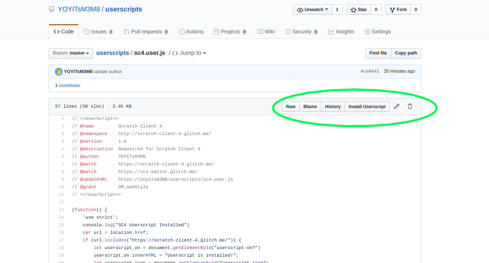

# userscripts

[TurbowarpScratchMod.user.js](https://github.com/YOYITsM3M8/userscripts/blob/master/TurbowarpScratchMod.user.js)

[sc5.user.js](https://github.com/yoyitsm3m8/userscripts/blob/master/sc5.user.js)

[git-userscript-install.user.js](https://github.com/yoyitsm3m8/userscripts/blob/master/git-userscript-install.user.js)

[ScratchBetterNav.user.js](https://github.com/yoyitsm3m8/userscripts/blob/master/ScratchBetterNav.user.js)

[OpenInColab.user.js](https://github.com/yoyitsm3m8/userscripts/blob/master/OpenInColab.user.js)

## git-userscript-install.user.js
### BEFORE

### AFTER

## sc5.user.js
Required for [SC5](https://scratch-client-5.glitch.me/) and [SC5 EDITOR](https://sc5-editor.glitch.me/)

## ScratchBetterNav.user.js
Changes "ideas" and "about" to "discuss" and "wiki" in the navbar

## TurbowarpScratcMod.user.js
adds "View in Turbowarp" next to "See inside"
   
## OpenInColab.user.js
adds a *Open In Colab* button
## Before

## After

